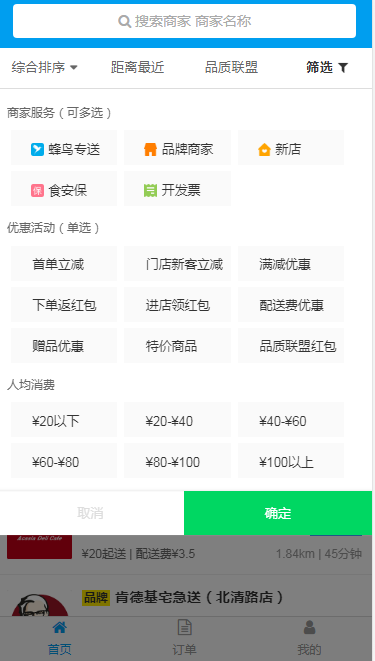

# vue实现高德地图定位和短信验证demo

	使用vue-cli3.0的脚手架搭建vue项目，在整个demo中，实现真正短信验证码登录，高德地图定位，搜索，以及城市列表，组件封装等功能
	实现短信验证码的时候，需要自己注册聚合数据，tpl_id，key填写两个值
## 项目结构
```
	|——— public  #发模式下静态资源目录
	|    |——— css #css文件
	|    |——— favicon.ico  #图标
	|    |——— index.html    #首页入口文件，你可以添加一些 meta 信息或同统计代码啥的
	|——— node_modules #一些常用安装的依赖
	|——— src #前端项目源码目录
	|	 |——— assets  #静态文件
	|    |——— router.js  #路由目录
	|    |——— store   #数据状态管理
	|    |——— App.vue #项目入口文件
	|    |——— main.js #项目核心文件
	|——— package.json #项目配置文件
	|——— babel.config.js #babel配置文件
	|——— vue.config.js #vue配置文件
	|___ README.md    #项目的说明文档
```

# 技术栈
 vue-cli3.0 + vuex +vue-router + ES6 + axios + 高德地图

    1. vuejs2.0：一套构建用户界面的渐进式框架，易用、灵活、高效。
	2. vue-router：官方的路由组件，配合vue.js创建单页应用（SPA）非常简单。
	3. axios: 基于 Promise 的 HTTP 请求客户端，可同时在浏览器和 node.js 中使用。
	4. better-scroll: 移动滚动插件

## 项目编译和运行
    1. 可以直接在git上下载项目源码。把github下载到本地，
	git clone git@github.com:MrZHLF/vue-map-phone.git
	2. 进入到ele-app目录，进行初始化，安装依赖
		npm run dev
	3. 依赖安装成功后执行启动命令
	   npm run dev
	   如果显示一下内容说明安装成功
	   I  Your application is running here: http://localhost:8081

## 成果展示



